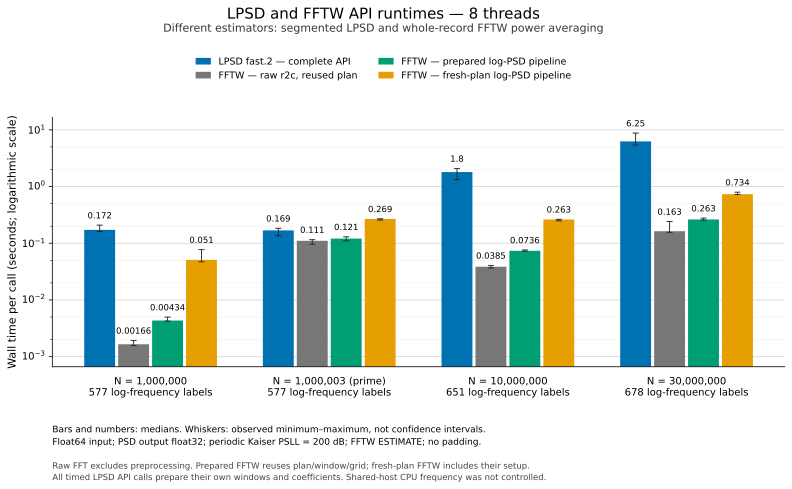
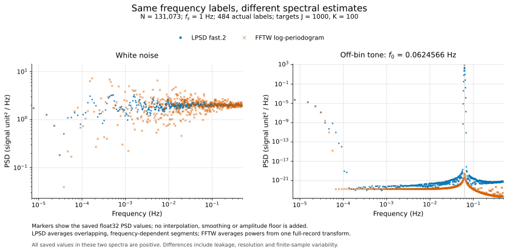

# LPSD headroom and an actual FFTW comparison

Measurements: **2026-10-08**, one Linux/x86-64 host, LPSD `1.0.6+fast.2`.
The native kernel was unchanged by this comparison. Subsequent
[fast.3 segment optimizations](performance-fast3.md) have their own matched
CPU measurements; the historical FFTW results below have not been relabeled
as a comparison with that later version.

**There is no demonstrated hardware or mathematical limit here.** The main
remaining LPSD cost is segment projection and accumulation. The additional
global FMA experiment did not establish a useful single-worker improvement
and changed real PSD outputs to complex dtype, so it was rejected.

An FFT-based logarithmic periodogram can be substantially faster, but it is a
**different estimator**. At ten million samples and eight workers/threads,
the measured medians were **1.799 s for LPSD**, **0.263 s for the complete FFTW
pipeline with a fresh plan**, and **0.0736 s when reusing its plan and window**.
Those are observed runtime ratios of 6.84 and 24.45, not speedups of numerically
equivalent LPSD implementations. At the awkward length 1,000,003, the fresh-plan
FFTW pipeline was actually slower than LPSD.

The complete evidence is in [results_fftw.json](../benchmarks/results_fftw.json),
[the numerical estimator comparison](../benchmarks/results_estimators.json)
and [the rejected FMA experiment](../benchmarks/experiments/fp_contract/README.md).
The JSON retains individual repetitions, build identities, profiles and the
official FFTW program's output. The earlier
[fast.2 versus fast.1 report](performance.md) remains a separate measurement
series; different timings in this new series are not a new production speedup.

## 1. Whole-call wall times

The table uses reals in `float64`, a seeded standard-normal signal, `fs=1`,
target frequencies `1000`, desired averages `100`, order-zero mean removal,
periodic Kaiser with `psll=200`, and PSD-only `float32` DataFrames. LPSD uses
`kernel="fast"` and a 4096 MiB concurrency budget. Each estimator receives
one full-problem warm-up before its ordinary timing repetitions.

All numbers below are **medians in seconds**. The raw FFTW column is from the
Python/C comparison adapter, not the minimum statistic of the official bench.

| Samples | Workers/threads | Actual log points | LPSD complete API | FFTW raw FFT | FFTW prepared complete pipeline | FFTW complete pipeline, fresh plan |
| ---: | ---: | ---: | ---: | ---: | ---: | ---: |
| 1,000,000 | 1 | 577 | 0.697730 | 0.005814 | 0.007726 | 0.036457 |
| 1,000,000 | 8 | 577 | 0.172171 | 0.001656 | 0.004339 | 0.050964 |
| 1,000,003 | 8 | 577 | 0.168595 | 0.110527 | 0.120736 | 0.268547 |
| 10,000,000 | 1 | 651 | 7.701015 | 0.158508 | 0.179237 | 0.381441 |
| 10,000,000 | 8 | 651 | 1.798623 | 0.038499 | 0.073553 | 0.262934 |
| 30,000,000 | 8 | 678 | 6.254108 | 0.163144 | 0.262619 | 0.733628 |



### What each column includes

**LPSD complete API** includes planning, conversion, windows, normalization,
Fourier/projected coefficients, every requested segment calculation and the
output DataFrame. It prepares these quantities again for each API call; a
full-length warm-up does not install a reusable LPSD plan.

**FFTW raw FFT** executes an aligned, out-of-place, double-precision real-to-
complex transform of the exact requested length. It reuses a plan and buffers.
It excludes copying, mean removal, windows, powers, logarithmic aggregation,
output construction and allocation.

**FFTW prepared complete pipeline** copies/anchors the input, removes the global
mean, multiplies the window, executes FFTW, forms a correctly normalized
one-sided PSD, averages neighboring bin powers into logarithmic groups, rounds
the result and constructs the DataFrame. It reuses the FFTW plan, aligned
buffers, full-record window, normalization, grid and scratch arrays.

**FFTW complete pipeline with a fresh plan** also clears wisdom, allocates
private work buffers, creates the plan, generates and normalizes the window,
constructs the grid and frees private buffers. Libraries are already loaded;
input generation, imports, validation and fingerprints are outside the timer.
“Fresh plan” is the meaning of the JSON's historical `cold_pipeline` field.
It does not mean a new process, unloaded libraries or intentionally cold CPU
caches. The public scripts call the categories out explicitly.

LPSD uses 5 ordinary repetitions except the 10M/one-worker and 30M/eight-worker
cases, which use 3. FFTW raw and prepared columns use 5 repetitions, with
multiple raw executions per repetition where appropriate. Fresh-plan ESTIMATE
uses 3 calls. Raw batch averages are divided by their actual execution counts.

### Variation and the length exception

LPSD/eight-worker ranges were **0.161–0.209 s at 1M**, **1.325–2.088 s at 10M**
and **5.415–8.775 s at 30M**. These are small observed samples, not confidence
intervals. Jobs ran serially with no other local benchmark/build deliberately
competing for CPU; the underlying shared host, CPU clocks and cache placement
were not controlled. Cross-estimator matrices were not a randomized crossover
experiment. Reported ratios should be interpreted at that precision.

The 1,000,003-point case is prime. FFTW retains its asymptotic FFT complexity
for this length, but its constants change substantially. Here the prepared
pipeline was only **1.40 times faster** than LPSD; the fresh-plan pipeline took
**1.59 times as long** as LPSD. No padding was used. Padding to a convenient
length may help a separately defined FFT method, but changes its sampled
frequency grid and logarithmic bin assignment and does not add information.

More threads do not guarantee a faster complete call either: for 1M,
FFTW/ESTIMATE with fresh setup took 36.5 ms at one thread and 51.0 ms at eight,
although its prepared transform benefited from threading. FFTW's official
[thread-count guidance](https://www.fftw.org/fftw3_doc/How-Many-Threads-to-Use_003f.html)
also distinguishes parallel execution gains from threading overhead.

## 2. The official FFTW testbench

[benchFFT](https://www.fftw.org/benchfft/) is the broader collection for
comparing many FFT implementations. For this task, the **unmodified
`tests/bench` shipped in FFTW 3.3.11** was built and run directly. The new
[bench_fftw_official.py](../benchmarks/bench_fftw_official.py) records its
commands, raw output and provenance; the separate adapter supplies the
application-level measurements above.

The official program used `orfN`: double-precision, out-of-place, real forward
transforms, with exact length N. Each row used a fresh process, no imported
wisdom, eight repeated execution batches and a minimum batch-time target of
0.1 seconds. As explained in FFTW's
[benchmark methodology](https://www.fftw.org/speed/method.html), the reported
execution time is the **minimum of the eight batch averages**, not a median
of complete PSD calls. There was one process per configuration here.

| Exact length | ESTIMATE, 1 thread, ms | ESTIMATE, 8 threads, ms | PATIENT capped at 5 s, 1 thread, ms | PATIENT capped at 5 s, 8 threads, ms |
| ---: | ---: | ---: | ---: | ---: |
| 1,000,000 | 4.946 | 1.614 | 6.252 | 2.050 |
| 1,048,576 | 6.517 | 1.751 | 6.397 | 2.003 |
| 1,000,003 | 131.253 | 89.419 | 140.597 | 103.760 |
| 10,000,000 | 150.789 | 36.566 | 152.778 | 40.469 |
| 30,000,000 | 557.557 | 140.205 | 569.858 | 162.335 |

The reported official setup is separate and excludes initial allocation,
thread initialization and an earlier ESTIMATE capability plan. It must not
be substituted for a complete first API call. Process wall time includes the
many repeated transforms and is likewise not the cost of one transform.
The official normalized “MFLOPS” convention is `2.5*N*log2(N)/time` for real
transforms; it is not a measured instruction or FLOP count.

PATIENT's five-second search did not improve execution in nine of ten
size/thread pairs in this matrix. Its setup ran about 5.008–5.898 seconds.
This demonstrates the outcome of a **bounded search on this host**, not that
ESTIMATE generally beats PATIENT or that an uncapped search could not improve
the plan. FFTW's [planner documentation](https://www.fftw.org/fftw3_doc/Planner-Flags.html)
specifies an approximate time budget and progressive planning rigor.

The application adapter also measured planners for 10M/eight-thread/log-PSD:

| Planner | Initial plan creation, s | Prepared pipeline median, s | Fresh-plan complete call, s |
| --- | ---: | ---: | ---: |
| ESTIMATE | 0.0985 | 0.07355 | 0.26293 |
| MEASURE, 5 s budget | 5.1268 | 0.07312 | 5.24493 |
| PATIENT, 5 s budget | 5.1466 | 0.07437 | 5.47233 |

Initial plan creation is one observation. MEASURE/PATIENT have five prepared
repetitions but only **one ordinary fresh-plan call** each; additional
profiles are independent calls. The sub-millisecond prepared differences
here do not establish a robust planning-payback estimate. Reusing a chosen
plan avoids repeatedly paying its search cost; saved
[FFTW wisdom](https://www.fftw.org/fftw3_doc/Words-of-Wisdom_002dSaving-Plans.html)
can retain planning knowledge across processes, while work buffers and windows
are separate resources.

## 3. Granular bottlenecks

### LPSD

The new **one-worker** profile at 10M took **8.05524 s**. Its independently
measured ordinary API median was **7.70101 s**. The following rows belong to
the instrumented call, not to the ordinary median:

| Phase | Profile seconds | Approximate share of profile |
| --- | ---: | ---: |
| Segment projections and inherited accumulation | 6.17126 | 76.61% |
| Window generation and sums, including associated work | 0.77693 | 9.65% |
| Native projected-coefficient preparation | 0.66205 | 8.22% |
| Fourier coefficients | 0.37029 | 4.60% |
| Remaining API/allocation/native dispatch/profiling work | 0.07471 | 0.93% |
| **Total** | **8.05524** | **100%** |

Window generation itself took 0.56900 s and the sequential sums 0.19871 s;
these are subdivisions of the window row. Native preparation and segments
subdivide the native kernel. Planning was 0.000742 s, input conversion
0.004215 s and final output assembly 0.001635 s. Worker phase sums cannot be
interpreted as serial shares when multiple workers overlap.

The work count remained **27,072,536,884 visits to segment samples** across
**21,624,884 segments**, 651 frequencies and **649 different segment lengths**.

| Segment length L | Frequencies | Segment-sample visits | Segment time, s |
| --- | ---: | ---: | ---: |
| L < 256 | 45 | 1.922 billion | 0.49043 |
| 256 ≤ L < 2048 | 135 | 5.765 billion | 1.30387 |
| 2048 ≤ L < 65536 | 224 | 9.553 billion | 1.92672 |
| 65536 ≤ L < 1048576 | 198 | 8.222 billion | 1.82176 |
| L ≥ 1048576 | 49 | 1.611 billion | 0.62849 |

Short segments below 2048 account for about **94% of all segments** and
**29.08% of segment time**, or 22.27% of the total profile. They are a useful
target for future PSD-specific segment bookkeeping. Optimizing only the
largest windows would miss this work.

### FFTW pipeline

A separate profiled prepared call for 10M/eight-thread/ESTIMATE took
**73.050 ms**:

| Prepared FFTW pipeline phase | Milliseconds |
| --- | ---: |
| Input view | 0.076 |
| Input copy and stable global mean removal | 12.990 |
| Window multiplication | 5.318 |
| FFTW execution | 39.668 |
| Power and one-sided normalization | 12.995 |
| Logarithmic power aggregation | 1.719 |
| Output conversion and DataFrame | 0.278 |

Thus a raw FFT alone omits roughly half of this application's elapsed work.
NumPy preprocessing/postprocessing uses explicit array operations, not a
hidden multithreaded BLAS dot product. FFTW's thread count controls the FFT.

For 10M/eight threads, keeping the **full linear periodogram** rather than log
groups took 75.1 ms prepared and 277.7 ms with fresh setup. The logarithmic
PSD took 73.6/262.9 ms. These are separate small samples with different output
sizes, so their small difference is not a proven aggregation speedup. The
log-NSD path took 71.5/253.4 ms in another run, within the variation of the
PSD path. NSD takes the square root after aggregating powers and after the
documented output rounding; it does not average FFT magnitudes.

## 4. How much optimization remains?

The measured serial segment fraction is p=0.76612. Accelerating that phase by
a factor s gives the familiar Amdahl relation

\[
S=\frac{1}{(1-p)+p/s}
\]

when s is the segment-phase speedup. These are conditional calculations for
this profile, assuming the other costs stay fixed:

| Hypothesis | Whole-call speedup for this profile |
| --- | ---: |
| Remove all nonsegment work, keep segments unchanged | At most 1.305× |
| Make segment work twice as fast | 1.621× |
| Reuse all measured window/coefficient preparation for another signal | Ideally 1.290× |

The reuse estimate removes 1.8093 s of measured preparation. Storing all
projected real/imaginary coefficients alone would require
`16*sum(L_j) = 3,575,867,376` bytes, about **3.33 GiB**, before inputs,
windows and other storage. A bounded cache or processing several channels
together is more realistic than an unlimited plan cache at larger N.

The native disassembly already uses AVX-512 ZMM registers in its long loops.
Increasing vector width again is therefore not an immediate new optimization
on this host. The global FMA candidate changed separate multiply/add operations
to fused instructions, but gave only about a 1% W1 median difference and
effectively identical segment time in its independent profile. It also
changed all nine probed PSD cases to complex dtype. Details and both aborted
real-spectrum audits are preserved in the
[experiment archive](../benchmarks/experiments/fp_contract/README.md).
The current strict contraction policy is retained.

The most defensible remaining directions are:

| Direction | Why it could help | Qualification |
| --- | --- | --- |
| PSD-specific handling of many short segments | Reduce generic complex/statistics bookkeeping and scalar divisions | Must preserve finite/overflow/NaN behavior and the inherited accumulation recurrence; not yet benchmarked |
| Adaptive segment blocking and cache layout | Existing four-segment batches share coefficients; another block size/order could improve reuse | Extra registers can spill; benefit is architecture-dependent and unmeasured |
| Shared preparation across equal-parameter signals | Avoid repeated windows and projected coefficients | Most useful for repeated records/channels, with a bounded memory policy; the serial preparation bound above applies |
| Coordinate concurrent generation of the same large window | Avoid duplicate work at the few repeated initial lengths | Narrow opportunity, not a general acceleration of all 649 distinct lengths |
| A separately specified FFT/log-power or multirate estimator | Avoid much of the repeated segment work | Requires its own transfer-function, statistical and accuracy contract; cannot inherit LPSD's pointwise error allowance |

Rectangular and finite cosine-sum windows also permit specialized sliding
Fourier sums and rolling detrending moments. These could reuse overlapping
samples while preserving the mathematical estimator. At fixed overlap this
primarily changes constants rather than the Θ(N M) order. Accumulated
roundoff, large-DC cancellation and arbitrary-frequency phase updates need
dedicated validation. Kaiser does not have the same representation with a
small, fixed number of harmonics, so this is not an established shortcut for
the measured default window.

A multirate filter bank can potentially reduce repeated full-rate work, but
anti-alias filtering, passband accuracy, segment boundaries and low-frequency
statistics need an explicit design. There is no implemented or measured
multirate speedup in this report. Likewise, no new GPU or ARM-versus-FFTW
throughput claim is made from an x86 measurement; the benchmark scripts and
existing [platform tests](platforms.md) provide a basis for separate runs.

Neither source-level load counts nor an observed plateau establish a DRAM
bandwidth limit. Overlapping segments reuse data in several cache levels.
No hardware-counter/roofline measurement here proves cache, memory bandwidth,
instruction throughput or scheduling is already optimal.

## 5. Why one FFT is a different computation

For frequency j, the current LPSD algorithm uses segment length L_j and K_j
overlapping segments, with detrending and windowed Fourier projection at that
frequency. For fixed polynomial order and built-in window parameters, its
serial work is described by

\[
T_{\mathrm{LPSD}}=
\Theta\!\left(N+\sum_{j=1}^{M}L_j+\sum_{j=1}^{M}K_j L_j\right).
\]

For fixed overlap below one and segments covering the record, K_j L_j is of
order N, giving **Θ(N M)** for this direct implementation, where M is the
**actual** number of returned frequency points. With M held fixed this is
linear in N; with a fixed actual number of logarithmic points per decade and
f_min proportional to 1/N, M grows as log N and the work becomes Θ(N log N).
The planner's target count is not necessarily the returned count; the measured
1000-point target returned 577, 651 and 678 at the three regular lengths.
These statements describe the implementation, not a lower bound for every
algorithm capable of estimating a logarithmic spectrum.

FFTW computes a whole-record DFT in **O(N log N)**, including arbitrary and
prime lengths, as specified in its
[real-data transform documentation](https://www.fftw.org/fftw3_doc/Real_002ddata-DFTs.html).
Forming powers and partitioning all FFT bins then adds O(N) work. The large
runtime difference can therefore coexist with a superficially similar
asymptotic order: this LPSD plan visits about 27 billion segment samples for
10 million input samples.

An individual LPSD segment needs one arbitrary-frequency coefficient,
which a direct projection evaluates in O(L). Computing all its FFT bins costs
O(L log L) and is useful only if enough requested coefficients share that
same segment/window/start grid. With 649 distinct L values among 651 output
frequencies, this particular plan offers little immediate grouping of that
kind. Off-grid Fourier frequencies add another constraint.

Similarly, FFTW's discussion of [pruned FFTs](https://www.fftw.org/pruned.html)
concerns selected outputs of one common DFT. It does not automatically turn
this collection of differently windowed segment projections into one cheap
pruned transform. Whether another convolution, batching or multirate design
wins remains an implementation and measurement question.

## 6. Numerical evidence: same labels, different estimators

The FFTW comparison uses one full-record periodic Kaiser window, removes one
global mean, computes all real FFT bins, normalizes the one-sided powers and
averages them into contiguous groups. LPSD uses a frequency-dependent window
length and segment average. Their leakage, equivalent noise bandwidth,
statistical averaging and finite-record behavior differ even when output
labels are exactly the same.

The normalization is

\[
P_k=c_k\frac{|X_k|^2}{f_s\sum_n w_n^2},
\qquad
\overline P_j=\frac{1}{|B_j|}\sum_{k\in B_j}P_k,
\]

with c_k=2 for positive non-Nyquist bins, and c_k=1 for DC and an even-length
Nyquist bin. The highest odd-length bin is doubled. Log groups exclude DC
and cover every positive FFT bin exactly once. Their exact integration width
is **|B_j| f_s/N**, not the nominal distance between group boundaries.

The numerical comparison used N=131073, fs=1, target frequencies=1000 and
averages=100, producing **484 identical labels** for each method. Both saved
PSD arrays are float32; FFTW's transform, normalization and bin aggregation
use double precision. The loaded native LPSD Kaiser generator supplies the
FFTW full-record window too. The smaller fs=50/J=96/K=16 values mentioned by
the script are its CLI defaults, not the parameters of this recorded run.

| Signal | Median pointwise relative difference from LPSD | Points with at least 1% relative difference | Maximum absolute PSD difference |
| --- | ---: | ---: | ---: |
| Unit standard-normal white noise | 14.95% | 465 / 484 | 4.606 |
| Unit-standard-deviation pink noise | 14.10% | 460 / 484 | 1460.53 |
| Unit-amplitude off-bin sine | 95.02% | 478 / 484 | 478.96 |
| 10 V DC plus 1 nV standard-normal noise | 13.62% | 453 / 484 | 3.440e-18 V²/Hz |



These are descriptive differences between estimators, **not FFTW rounding
errors**. Relative differences divide by each nonzero LPSD point without a
floor; deep sidelobes make the tone's relative figures especially sensitive.
The absolute difference and complete small output spectra are also saved.
Finite-record statistical differences must not be confused with the permitted
sub-1% numerical approximation of the same estimator.

For example, the white-noise FFTW positive-band integral was 1.01517, while
the LPSD points weighted by the FFT groups' widths summed to 1.00047. For the
tone the analogous values were approximately 0.50000 and 0.49935. Similar
integrated power does not imply pointwise equivalence. The LPSD weighted sum
is a comparison quadrature of point values, not a LPSD Parseval identity.
The actual FFTW Parseval and exact positive-bin aggregation checks passed.
A single realization establishes neither a general bias nor a variance ratio.

## 7. Reproduce the comparison

The machine reported an AMD EPYC 9V74, Linux x86-64, nine CPUs in the affinity
mask, an eight-CPU cgroup quota and 8 GiB memory. Software: Python 3.12.14,
NumPy 2.3.5, pandas 2.2.3 and GCC 13.3.0. Timed jobs set
`OPENBLAS_NUM_THREADS=1` and `OMP_NUM_THREADS=1`.

LPSD's final native library used `-O3 -std=c11 -fno-fast-math -ffp-contract=off
-fPIC -march=native -fopenmp-simd`, shared linking and libm. Its SHA256 remains
`b0ab2e54a6231bd54b8d01c9c364efadb924c8e41dcc0398ef637f29d3e9e623`.

FFTW was built from the official
[3.3.11 release archive](https://www.fftw.org/download.html), SHA256
`5630c24cdeb33b131612f7eb4b1a9934234754f9f388ff8617458d0be6f239a1`.
The installed FFTW core hash is
`1db4b94b3c44073b16fde0a28cf4e3020fc904a181ec36323b39048435db305d`.
The official bench uses its build-tree libraries; the Python adapter uses
the installed files from that same build. Libtool relinked the thread library
during installation, so its two file hashes differ and are recorded separately.

Example native x86 build from the extracted FFTW release directory:

```bash
./configure --prefix="$PWD/../fftw-install" \
  --enable-shared --disable-static --enable-threads \
  --enable-sse2 --enable-avx --enable-avx2 --enable-avx512 \
  --disable-fortran CFLAGS='-O3 -march=native'
make -j8
make install
```

The SIMD configure switches above are specific to the measured x86 host.
Choose supported FFTW build options on another architecture and record them.
From the LPSD checkout, set paths to the local FFTW build and installation:

```bash
export FFTW_SOURCE=/absolute/path/to/fftw-3.3.11
export FFTW_INSTALL=/absolute/path/to/fftw-install
export OPENBLAS_NUM_THREADS=1
export OMP_NUM_THREADS=1

python benchmarks/bench_fftw_official.py \
  --source "$FFTW_SOURCE" \
  --archive /absolute/path/to/fftw-3.3.11.tar.gz \
  --release-url https://www.fftw.org/fftw-3.3.11.tar.gz \
  --sizes 1000000 1048576 1000003 10000000 30000000 \
  --threads 1 8 --planners estimate patient --planning-seconds 5 \
  --batch-min-seconds .1 --batch-repeats 8 --process-repeats 1 \
  --output-directory benchmark-results/fftw-official --run

python benchmarks/bench_fftw.py \
  --n 10000000 --threads 8 --planner estimate \
  --fftw-library "$FFTW_INSTALL/lib/libfftw3.so.3" \
  --threads-library "$FFTW_INSTALL/lib/libfftw3_threads.so.3" \
  --window-backend native \
  --lpsd-fast-library "$PWD/lpsd_fast/_native/liblpsd_fast.so" \
  --repeats 5 --cold-repeats 3 --warmups 1 --raw-batch-seconds .1 \
  --profile --output benchmark-results/fftw-10m-8t.json

python benchmarks/bench_lpsd.py \
  --backend fast --kernel fast --outputs psd \
  --n 10000000 --workers 8 --max-working-mb 4096 \
  --repeats 5 --warmups 1 --full-length-warmup \
  --output benchmark-results/lpsd-10m-8w.json

python benchmarks/compare_estimators.py \
  --n 131073 --sample-rate 1 --n-frequencies 1000 --n-averages 100 \
  --fftw-library "$FFTW_INSTALL/lib/libfftw3.so.3" \
  --threads-library "$FFTW_INSTALL/lib/libfftw3_threads.so.3" \
  --output benchmark-results/estimator-comparison.json
```

Change N/threads to reproduce the other rows. `--aggregation none` returns
the full linear periodogram, and `--density nsd` selects its square-root
density. Use `--planner measure` or `patient` with
`--planner-time-limit 5 --cold-repeats 1` for the recorded planning experiments.
The official runner prints its commands without executing them unless `--run`
is supplied. Its output directory must be new to preserve prior evidence.

To regenerate the committed figures with Matplotlib, using only stored data:

```bash
python benchmarks/plot_comparisons.py \
  --results benchmarks/results_fftw.json \
  --estimators benchmarks/results_estimators.json \
  --output-directory docs/figures
```

The figure metadata records the input-file hashes and plotting-library version.

## 8. Validation and scope

The integrated local suite completed **354 passed, 2 expected failures**:
the existing 300 fast tests, 18 original upstream tests, 27 new FFTW adapter
tests and 9 official-runner checks. The existing expected failures concern
uniform relative error at deep tone nulls and an inherited upstream standard-
error defect; neither was introduced or hidden by this comparison.

The FFTW tests include agreement with a separate rFFT implementation on small
signals, even/odd Nyquist handling, DC weighting, windowed Parseval, exact
positive-bin coverage, stable DC-plus-small-noise detrending, input/output
ownership, NSD rounding, threaded execution and fresh-plan timing metadata.
The official wrapper checks parsing, rejected option warnings, timeout cleanup
and dry-run behavior. One Linux/x64 CI job installs system FFTW and requires
all 27 adapter tests to execute without skips; that functional dependency is
separate from the locally built 3.3.11 performance binaries.

No LPSD production kernel, original upstream source, default output selection
or numerical policy was changed in this comparison. FFTW is an optional
benchmark dependency, not a new requirement for installing or using LPSD.
The full-record FFTW periodogram is a comparison instrument, not a silently
substituted LPSD backend.
