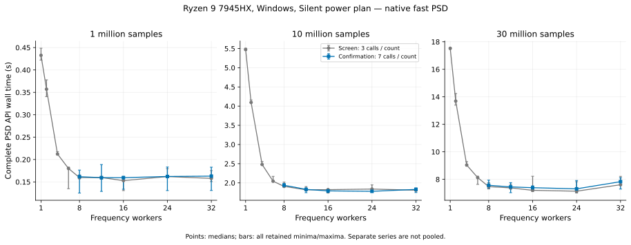
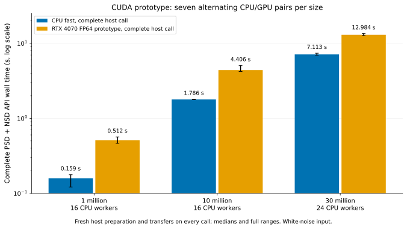

# Local Windows acceleration measurements

Measured on 2026-10-10, starting from `7092ef6ef5e1ab86fe41bb12b8444bb76bf9c0fa`
(`fast.4`). **The tested CUDA and AMD OpenCL implementations did not beat
the optimized CPU.** CPU frequency workers plateau around 16–24. Local native
compilation helps, and a prepared CPU plan reduces repeated preparation work.
The GPU implementations remain isolated benchmark experiments; neither is a
production backend.

The [summary](../benchmarks/results_windows_20261010.json) and
[sanitized detailed evidence](../benchmarks/results_windows_20261010_raw.json.gz)
retain every timing observation, separate profiles, numerical metrics, build
fingerprints, test outcomes and source snapshots. Public artifacts omit user
paths, machine names, process inventories, device identifiers and private
email. Unredacted originals and earlier failure logs remain local in
`.validation/`. Redaction does not change numerical values or timing samples.

## Hardware and measurement conditions

| Item | Observed configuration |
|---|---|
| CPU | Ryzen 9 7945HX, 16 cores / 32 logical CPUs |
| Memory | Approximately 64 GiB installed |
| Windows power plan | Silent; unchanged throughout |
| NVIDIA GPU | RTX 4070 Laptop, approximately 8 GiB, compute capability 8.9, 36 SMs |
| NVIDIA driver / toolkit | 581.80 / already installed CUDA 12.9; driver reports CUDA 13.0 capability |
| CUDA runtime | CuPy 14.2.0, actual FP64 kernels executed |
| GPU FP64 capability | Driver-reported FP32:FP64 throughput ratio 64 |
| Available VRAM initially | Approximately 899–1,067 MiB; existing applications were left running |
| Integrated GPU | Radeon 610M, OpenCL device `gfx1036`, actual FP64 execution |
| OpenCL runtime | PyOpenCL 2026.1.4; AMD driver reports AMD-APP 3652.0 |
| Compiler | MinGW GCC 15.2.0, `-O3 -fno-fast-math -ffp-contract=off` |
| Main CPU measurements | `-march=native -fopenmp-simd`, no target clones on Windows |
| Python / NumPy / pandas | 3.12.14 / 2.5.3 / 2.3.3 |
| Other runtime | SciPy 1.18.1, pyFFTW 0.15.1; full dependency freeze in detailed evidence |

Performance jobs ran sequentially. All observations are retained, including
slow ones. Background workload, temperatures and clock rates were not held
constant; separate series therefore remain separate. No power-plan changes,
driver changes or reboot were required. CUDA 12.9 executed the selected work,
so installing another toolkit was unnecessary.

Unless a section states otherwise: float64 white-noise input, PCG64 seed
20261008, sample rate 1 Hz, requested 1,000 frequencies and 100 averages,
Kaiser PSLL 200 with inherited overlap, order-0 detrending, `kernel="fast"`,
PSD output and a 4,096 MiB concurrency budget. The actual frequency counts
are 577 / 651 / 678 for 1 / 10 / 30 million samples. Imports, input creation,
warm-up, comparisons and file writes are outside the API timing. Every worker
configuration receives a full-size warm-up before measured repetitions.

## CPU parallelism

The first screen measured 1, 2, 4, 6, 8, 12, 16, 24 and 32 frequency workers
three times per size, in deterministically shuffled order. A separate seven-call
confirmation measured 8, 12, 16, 24 and 32. Its medians, in seconds:

| Samples | 8 workers | 12 | 16 | 24 | 32 |
|---|---:|---:|---:|---:|---:|
| 1 million | 0.161585 | 0.159546 | 0.159419 | 0.162134 | 0.162880 |
| 10 million | 1.938707 | 1.830367 | 1.791641 | 1.780143 | 1.830032 |
| 30 million | 7.570330 | 7.449611 | 7.393024 | 7.309616 | 7.833425 |



**Use 16 workers as a practical explicit starting point on this machine.**
Twenty-four was the lowest observed confirmation median at 10/30 million,
but only 0.64% / 1.13% below 16. The ranges overlap. Thirty-two was 7.17%
slower than 24 at 30 million. This establishes a broad plateau, not one
universal optimum or a reason to change the library's global default.

A separate three-call check of the unchanged automatic worker/default-memory
heuristics selected 32 workers. Automatic versus explicit 16 medians were
0.129782 / 0.129381 s, 1.816288 / 1.821786 s and 7.455813 / 7.380134 s.
The automatic setting is usable here; it is not consistently faster. These
different-series absolute times are not pooled with the confirmation.

Windows' actual processor-core masks supplied a second experiment: all CPUs
with 16 or 24 workers versus one logical CPU per physical core with 16 workers.
Seven balanced repetitions at 10/30 million found no repeatable benefit:

| Samples | All CPUs, 16 | All CPUs, 24 | One CPU/core, 16 |
|---|---:|---:|---:|
| 10 million | 1.999214 | 2.010080 | 2.002066 |
| 30 million | 7.784563 | 7.875503 | 7.878059 |

Affinity was restored after the experiment. SMT restriction is not recommended
from these results. CSD uses `y=.7*x+.6*new_noise`. A separate CSD screen also
measured all nine worker counts at 1/10 million; a seven-call confirmation
at 10 million gave:

| CSD samples / series | 8 workers | 12 | 16 | 24 | 32 |
|---|---:|---:|---:|---:|---:|
| 1 million, 3-call screen | 0.212019 | 0.185539 | 0.187635 | 0.187617 | 0.199285 |
| 10 million, 7-call confirmation | 3.358821 | 3.295490 | 3.230928 | 3.215030 | 3.547864 |

At 10 million, 24 is only 0.49% below 16; 32 is 10.35% slower than 24.
Sixteen is also a practical CSD choice for these records. The lowest observed
1-million CSD screen median was at 12. Every worker output within each PSD/CSD
size and series was bitwise equal. A 30-million CSD sweep was not performed.

An earlier local CSD check, kept separately, gave one/eight-worker medians
0.762652 / 0.170812 s at 1 million and 9.713524 / 3.331417 s at 10 million.
The [historical CSD candidate](../benchmarks/results_csd_batches.json), before
FMA integration, recorded 0.954886 s at 1 million/one worker and 3.604374 s at
10 million/eight workers. That archive is not relabeled as the final fast.4
build or pooled with the local worker series.

## Native compilation and plan reuse

Seven alternating pairs compared separately built portable and native DLLs
through the same complete public API, with the same inputs and parameters.

| Samples | Workers | Portable (s) | Native (s) | Portable/native |
|---|---:|---:|---:|---:|
| 1 million | 1 | 1.060400 | 0.437265 | 2.43× |
| 1 million | 16 | 0.170180 | 0.160856 | 1.06× |
| 10 million | 1 | 12.186279 | 5.514362 | 2.21× |
| 10 million | 16 | 2.287185 | 1.799374 | 1.27× |

This measures the combined `-march=native` build benefit, not an isolated
AVX-512 instruction effect. Portable wheels retain their baseline ISA.

The experimental prepared plan retains the same coefficients, starts,
normalization and inherited aggregation for fixed default PSD parameters.
The prepared CPU comparator receives the same host plan as the GPU; it does
not gain a different estimator. Seven alternating calls per implementation:

| Samples | Public CPU (s) | Prepared CPU (s) | Reduction | Host plan construction (s) |
|---|---:|---:|---:|---:|
| 1 million | 0.157836 | 0.062671 | 60.3% | 0.200461 |
| 10 million | 1.941864 | 1.204096 | 38.0% | 1.696567 |
| 30 million | 7.423837 | 5.895819 | 20.6% | 6.125803 |

CPU workers were 16. Plan construction is excluded from the prepared-call
column and reported separately. Host plans occupy approximately 3.66 GB /
10.29 GB at 10/30 million, so this is a speed/memory tradeoff for repeated
records, not a free acceleration. The first record pays construction cost.
No public reusable-plan API, parameter invalidation policy or general CSD/
variance plan is implemented by this experiment.

## Actual GPU execution

The isolated adapter prepares projected FP64 coefficients and windows on
the CPU, copies input once, executes segment dots/powers on the GPU and
returns powers for the inherited host averaging recurrence. It regenerates
preparation and transfers on each ordinary call. Exact repeated-addition
segment starts, float32 PSD conversion and inherited NSD square root are
retained. Initial CPU projections protect the cancellation-sensitive first
update; they are included in timing.

Six CUDA layouts (warp/block × 64/128/256 threads) were screened at eleven
lengths using seven resident device-event observations. The selected policy
uses warp-128 below 65,536 samples and block-256 for longer segments.
Those event timings exclude preparation and transfers and are diagnostic;
the complete-call table below includes both.

Seven alternating CPU/CUDA pairs, PSD **and NSD**, with fresh host preparation:

| Samples | CPU workers | CPU (s) | CUDA (s) | CUDA/CPU | First complete CUDA call (s) |
|---|---:|---:|---:|---:|---:|
| 1 million | 16 | 0.158529 | 0.511722 | 3.23× | 0.752180 |
| 10 million | 16 | 1.786409 | 4.405979 | 2.47× | 4.299260 |
| 30 million | 24 | 7.113323 | 12.983555 | 1.83× | 12.697995 |



The ordinary white-noise PSD/NSD arrays were bitwise equal to the paired CPU
results in these runs. This does not replace the independent accuracy audits
below. First-call timings include constructor, relevant CUDA initialization,
allocations and synchronization; process startup and CPU imports are excluded.
The main series had an existing on-disk CuPy kernel cache. A separate new-cache
1-million run measured 0.840632 s for its first complete call, including kernel
compilation/cache creation; it is one observation, not a cold-start median.

Separate CUDA profiles, in seconds:

| Samples | Host preparation | GPU plus transfers | CPU initial/aggregation | Profiled wall |
|---|---:|---:|---:|---:|
| 1 million | 0.207217 | 0.260396 | 0.035383 | 0.505353 |
| 10 million | 1.859815 | 1.931982 | 0.428642 | 4.230013 |
| 30 million | 5.512994 | 5.906117 | 1.333787 | 12.777810 |

The transfer column includes coefficient/start H2D, GPU execution and power
D2H; it does not isolate pure kernel time. Input copy, planning and output
assembly explain additional wall time. Moving dots alone leaves substantial
CPU preparation and data movement. The reported low FP64 ratio and these
profiles are plausible contributors; no experiment isolates one causal factor.

At 1 million samples a resident plan occupied 452.9 MB. Prepared GPU with fresh
host input took 0.217510 s; already resident input took 0.215067 s. The matched
prepared CPU took 0.062671 s. Eliminating plan transfers therefore did not make
this GPU faster. Ten-million resident payload is 3.92 GB, beyond the available
VRAM during this session; 30-million payload is 11.05 GB, beyond the card's
total capacity. Those larger GPU resident plans were not executed. CPU-only
plan studies do not allocate those GPU buffers.

Radeon 610M OpenCL FP64 was also executed: at 1 million, three alternating
pairs gave CPU 0.158573 s versus GPU 1.990021 s, **12.55× slower**. Its first
call was 4.208660 s. No larger AMD performance sweep is justified by this
result; its separate 21-case numerical audit was completed.

An actual synchronized CuPy transfer test checked every returned bit outside
the timer, seven repetitions per direction and memory type. Host-wall GB/s:

| Payload | Pageable H2D / D2H | Pinned H2D / D2H |
|---|---:|---:|
| 8 MiB | 11.33 / 11.05 | 12.57 / 12.91 |
| 80 MB | 12.35 / 12.69 | 7.84 / 7.84 |
| 240 MB | 12.80 / 12.82 | 11.84 / 11.76 |

Pinned memory was not uniformly faster. Memory types were not balanced in
order, so this is descriptive evidence, not an isolated pinned-memory effect.
This was not NVIDIA `nvbandwidth` or AMD TransferBench execution.

## Historical EPYC comparison and FFTW

The existing EPYC 9V74 Linux environment exposed nine logical CPUs and an
**eight-CPU cgroup quota**, not the entire processor. Its `fast.4` measurements
are archived in [results_fast4.json](../benchmarks/results_fast4.json).
The local three-call worker screen and historical six-pair candidate medians:

| Samples | Workers | Historical EPYC (s) | Local Ryzen (s) |
|---|---:|---:|---:|
| 1 million | 1 | 0.507496 | 0.432739 |
| 10 million | 1 | 7.888222 | 5.475908 |
| 10 million | 8 | 1.650249 | 1.908388 |

Parameters, distribution and seed match, but raw input SHA-256 agrees only
for the 1-million case. The 10-million hashes differ; the cause was not
established, and exact sample equality is not claimed. Windows/MinGW GCC 15.2,
NumPy 2.5.3 and the Silent plan differ from Linux/GCC 13.3/NumPy 2.3.5 and the
EPYC host policy. There is no fresh EPYC execution or controlled processor
ranking. The eight-worker local median is slower in this descriptive comparison;
more local workers reduce it to roughly 1.78–1.79 s in the confirmation series.

The local FFTW adapter used the pyFFTW DLL's actual reported
`fftw-3.3.5-sse2-avx`, eight FFTW threads, ESTIMATE planning and seven calls per
scope. All finite/Parseval/power-preserving grouping checks passed.

| Samples | Raw FFT, reused plan (s) | Prepared full pipeline (s) | Fresh-plan full pipeline (s) |
|---|---:|---:|---:|
| 1,000,000 | 0.001629 | 0.004198 | 0.051158 |
| 1,000,003 | 0.044665 | 0.045004 | 0.201216 |
| 10,000,000 | 0.033779 | 0.056351 | 0.457065 |
| 30,000,000 | 0.107996 | 0.258114 | 1.490138 |

The earlier [EPYC FFTW report](fftw-comparison.md) used FFTW 3.3.11 and
`fast.2`; at 10 million its corresponding raw/prepared/fresh medians were
0.038499 / 0.073553 / 0.262934 s, and at 30 million 0.163144 / 0.262619 /
0.733628 s. This is neither the same FFTW build nor a `fast.4` comparison.
Full-record FFT plus log grouping has different resolution, transfer and
variance from segmented LPSD. Its smaller times cannot be advertised as an
equivalent LPSD speedup. No GPU FFT alternative estimator was benchmarked.

A small matched `N=100000` run also executed original C and all-output `auto`:
original 0.938186 s (one observation), auto one/32 workers 0.477701 /
0.068520 s, selected fast PSD one/32 workers 0.048732 / 0.040170 s (three-call
medians). Auto/fast differ in output work and Windows arithmetic. The original
call received the harness's small warm-up, not a full-size warm-up.

## Verification, failures and implemented fixes

| Check | Actual result |
|---|---|
| Historical EPYC `fast.4` complete suite | 1,032 passed, 2 expected failures |
| Final local portable build, both test directories | 1,179 passed, 2 expected failures, 4 warnings, 23.01 s |
| Final local native build, both test directories | 1,179 passed, 2 expected failures, 4 warnings, 22.18 s |
| Installed portable wheel, isolated outside checkout | Both native libraries load; original/scalar equality, auto, fast, PSD/NSD gates pass |
| Actual CUDA segment gates | 144 signal/length/layout cases, exact start indices and explicit order-1 fallback tests pass |
| Windows auto, 19 cases × 2 lengths | All combined criteria pass; exact frequency grids |
| Explicit CPU fast, same 38 cases | DC-plus-nanovolt fails at both lengths |
| CUDA, 21 cases × 2 lengths | DC-plus-nanovolt fails at both lengths |
| AMD OpenCL, 21 cases at 32,769 | DC-plus-nanovolt fails |

The added tests account for the difference in counts; the existing 1,032
tests were also executed. There were no optional-device/library skips locally.
The two expected failures remain the known off-bin uniform-relative assertion
and preserved upstream K=2 variance defect. Four warnings are a setuptools
deprecation and three upstream time-axis/NaN warnings.

The independent scalar audits require relative error strictly below 1% **or**
absolute PSD error at most `1e-24`, NSD at most `1e-12`, in the synthetic signal's
units. No DC-scaled amplitude floor is used. Deep HFT248D tone-null cases can
pass only the absolute allowance, even for auto; no uniform relative guarantee
is claimed. For DC-plus-nanovolt, CPU fast/CUDA/OpenCL maximum PSD errors were
2.310824% at 32,769 and CPU fast/CUDA 1.832056% at 131,073. These exceed the
combined criterion. GPU dots alone do not repair the shared host projection.
The current failing audit commands return exit code 1.

Windows auto now selects the original residual detrending/SIMD path for order
0. Its existing strict DC regression gate passes unchanged. Explicit fast and
GPU experiments retain their measured projected arithmetic and limitations.
The cause of the projected Windows error has not been isolated to a specific
compiler or math-library operation.

Other fixes required by actual local failures:

- `QueryPerformanceCounter` replaces Windows POSIX profiling-clock calls,
  removing an unintended `libwinpthread` loading dependency from the fast DLL.
- Compiler ABI tests use a separately compiled C probe: MinGW C long double
  has 64 bits/16 bytes while this NumPy wheel has 53 bits/8 bytes.
- A Linux cgroup fixture normalizes paths independently of the host separator.
- FFTW's optional plan-string diagnostic is omitted on Windows after an actual
  heap failure from incompatible allocation/free conventions; FFTW numerical
  execution and flop diagnostics remain tested.
- LF checkout rules preserve the upstream reference-source hash gate. Original
  `lpsd/` source contents and numerical assertions are unchanged.

Earlier failed runs remain documented in the detailed evidence: the initial
DLL-load errors, FFTW heap failure, line-ending/source-binding failures,
pre-fix auto DC failure, an initial GPU harness column-name error and the first
wheel-smoke rejection because its venv was inside the checkout. The final
wheel was installed and verified outside the checkout. These failed attempts
are not counted as successful verification.

Not verified: a fresh EPYC run; Windows MSVC/Clang or a Windows CI job; other
power profiles, clean exclusive GPU use, other GPUs, GPU CSD/variance,
order-1+ GPU detrending, GPU extreme-overflow behavior, FP32/tensor-core
approximations, CUDA graphs, pipelined host preparation, NPU/FPGA offload or
production plan reuse. Those are separate engineering/measurement questions.

## Reproduce locally

Use standard CPython and a MinGW GCC available on PATH. GPU packages and FFTW
are optional experiments; normal `lpsd_fast` imports gain no GPU dependency.
PowerShell, from the checkout:

```powershell
py -3.12 -m venv .venv
& .\.venv\Scripts\python.exe -m pip install '.[test]' build psutil pyfftw cupy-cuda12x pyopencl matplotlib
$env:OPENBLAS_NUM_THREADS='1'
$env:OMP_NUM_THREADS='1'
& .\.venv\Scripts\python.exe build_native.py
& .\.venv\Scripts\python.exe -m lpsd_fast.build --native
& .\.venv\Scripts\python.exe -m benchmarks.cuda_lpsd
$env:LPSD_TEST_FFTW_LIBRARY=(Resolve-Path .venv\Lib\site-packages\pyfftw\libfftw3-3.dll).Path
$env:LPSD_TEST_FFTW_THREADS_LIBRARY=$env:LPSD_TEST_FFTW_LIBRARY
$env:LPSD_TEST_FAST_LIBRARY=(Resolve-Path lpsd_fast\_native\liblpsd_fast.dll).Path
& .\.venv\Scripts\python.exe -m pytest -o addopts='' -q test_fast test

& .\.venv\Scripts\python.exe -m benchmarks.bench_workers --workers 1 2 4 6 8 12 16 24 32 --repeats 3 --output .validation\worker-screen.json
& .\.venv\Scripts\python.exe -m benchmarks.bench_workers --workers 8 12 16 24 32 --repeats 7 --profile --output .validation\worker-confirm.json
& .\.venv\Scripts\python.exe -m benchmarks.bench_workers --kind csd --sizes 1000000 10000000 --workers 1 2 4 6 8 12 16 24 32 --repeats 3 --output .validation\csd-worker-screen.json
& .\.venv\Scripts\python.exe -m benchmarks.bench_workers --kind csd --sizes 10000000 --workers 8 12 16 24 32 --repeats 7 --output .validation\csd-worker-confirm.json
& .\.venv\Scripts\python.exe -m benchmarks.bench_affinity --output .validation\affinity.json
& .\.venv\Scripts\python.exe -m benchmarks.bench_cuda --mode tune --n 1048576 --output .validation\cuda-tuning.json
& .\.venv\Scripts\python.exe -m benchmarks.bench_cuda --n 10000000 --workers 16 --output .validation\cuda-10m.json
& .\.venv\Scripts\python.exe -m benchmarks.bench_cuda --mode audit --n 131073 --output .validation\cuda-audit-131073.json
& .\.venv\Scripts\python.exe -m benchmarks.bench_cuda --backend opencl --platform AMD --n 1000000 --workers 16 --repeats 3 --output .validation\opencl-amd-1m.json
& .\.venv\Scripts\python.exe -m benchmarks.bench_cuda_transfers --output .validation\cuda-transfers.json
& .\.venv\Scripts\python.exe -m benchmarks.bench_cuda_reuse --cpu-only --n 10000000 --workers 16 --output .validation\cpu-reuse-10m.json
& .\.venv\Scripts\python.exe -m benchmarks.check_accuracy --kernel auto --n 131073 --psd-absolute-limit 1e-24 --nsd-absolute-limit 1e-12 --fail-on-limit --output .validation\accuracy-auto-131073.json
& .\.venv\Scripts\python.exe -m benchmarks.bench_fftw --n 10000000 --threads 8 --repeats 7 --fftw-library $env:LPSD_TEST_FFTW_LIBRARY --threads-library $env:LPSD_TEST_FFTW_THREADS_LIBRARY --profile --output .validation\fftw-10000000.json
& .\.venv\Scripts\python.exe -m benchmarks.plot_windows --results benchmarks\results_windows_20261010_raw.json.gz
```

Serialize performance commands. CUDA requires a compatible driver/toolkit;
OpenCL requires a vendor runtime exposing the selected FP64 device. Build the
bridge before optional GPU tests. The GPU audit command above is expected to
fail the documented DC case; it must not be presented as a passing gate.
Reports generated by the scripts are local, unredacted evidence. Review and
sanitize identifiers and paths before publishing a new report.

Source archives include the experimental C/CUDA/OpenCL files. Normal wheels
contain only the library packages and portable native libraries. Public
artifacts contain no generated DLLs, environments, local process snapshots or
private logs. Source snapshots in the evidence preserve measured pre-LF bytes;
final builds/tests use normalized LF sources, so their source fingerprints can
differ without arithmetic changes. Recorded local commit IDs precede the
publication author-metadata adjustment; the evidence includes a mapping to
commits with identical trees. Generated build sidecars are excluded after all
source include rules, so the benchmark JSON glob cannot reintroduce them into
source archives.
