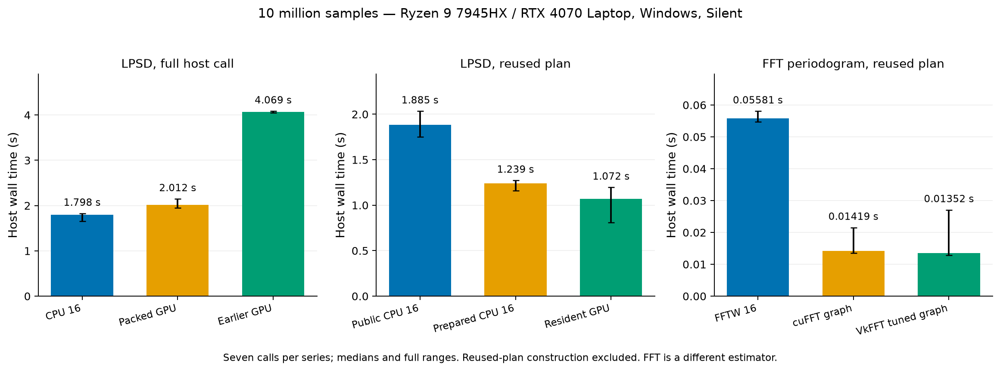

# Further Windows CUDA and GPU FFT optimization

Measured on 2026-10-10, starting from `61654bef655cf7435a13676acf35d16fdc9b8652`.
The [initial direct-kernel prototype](windows-accelerators.md) was not exhausted.
Packed execution now cuts its complete-call time approximately in half in
the paired 1/10-million-sample comparisons. At 30 million samples it beats
the CPU by **15.9% including new coefficient preparation and transfers**.
A reused 10-million-sample GPU plan beats the matched prepared CPU plan by
13.5% in alternating calls and 27.4% in a separate consecutive-call series.
Small LPSD calls remain faster on the CPU.

Actual **cuFFT and VkFFT** provide larger speedups for a full-record FFT
periodogram. That periodogram has a different filter, resolution and variance
from LPSD. The mathematically corresponding cuFFT convolution of LPSD's
individual projections was tested too, and was slower than direct LPSD.
No production GPU dispatch or estimator definition was changed.

The [summary](../benchmarks/results_windows_optimization_20261010.json) and
[sanitized detailed evidence](../benchmarks/results_windows_optimization_20261010_raw.json.gz)
include the accepted timing samples, separate profiles, exploratory numerical
failures, test outcomes, raw-kernel source fingerprints and final source text.
Some earlier exploratory Python revisions are represented by fingerprints,
not complete source snapshots; replay commands use the final selected defaults.
One briefly overlapped series was discarded and repeated. A subsequent
three-plan FFT series exhausted VRAM; its observations are retained but excluded
from accepted results. Private paths and device/person identifiers are omitted.
All signals are synthetic; no private measurement data were used.



## Conditions and interpretation

Ryzen 9 7945HX, 16 cores/32 logical CPUs, approximately 64 GiB RAM;
RTX 4070 Laptop, approximately 8 GiB; Windows **Silent** power plan unchanged.
Driver 581.80, existing CUDA 12.9, CuPy 14.2.0 and cuFFT runtime version
`11401` (11.4.1). PyVkFFT 2025.1.1 was built and installed using the existing
Visual Studio/CUDA toolchain. FFTW is the actual pyFFTW-bundled
`fftw-3.3.5-sse2-avx`, not the archived EPYC's FFTW 3.3.11.

Approximately 7.4 GB device memory was free at the start, versus about 1 GB
in the initial study. Existing applications were not closed. No driver update,
toolkit replacement, power-plan change, GPU clock lock or reboot was performed.
Compilation uses the same native MinGW GCC 15.2 CPU backend. GPU FP64 FMA is
enabled for the selected packed kernels; global fast-math is not enabled.

Unless stated otherwise: float64 PCG64 white noise, seed 20261008, sample rate
1 Hz, periodic Kaiser PSLL 200, order-zero detrending, 1,000 requested
frequencies and 100 averages. Actual LPSD grids have 577/651/678 frequencies
at 1/10/30 million samples. LPSD returns PSD and NSD with inherited complex64
output rounding. All performance jobs are serial. GPU transfers synchronize.
Seven measurements follow warmups; first calls and plan construction are
separate. Timers exclude process launch, input generation and accuracy checks.

Alternating CPU/GPU calls include idle intervals between GPU calls. The
separate burst schedule performs five consecutive warmups per implementation
and then seven consecutive complete calls. It changes the call schedule;
its samples are not pooled with alternating samples. Optional NVML readings
capture clocks, power, temperature and performance state only. Laptop clock
states, background activity and temperatures were not held constant, so these
are local observations rather than universal hardware rankings.

## What was optimized

`benchmarks/cuda_packed.py` prepares frequencies in parallel into contiguous
host coefficient buffers. It groups frequencies into bounded GPU batches,
reuses device work buffers, reads back powers once per batch and overlaps the
next host preparation with device work. The selected defaults are 16 host
workers, a 1 GiB batch target, a warp/block boundary at length 16,384, 32,768
samples per split tile and FP64 FMA. Long projections distribute across
multiple blocks and reduce their partial results in FP64.

The exact repeated-addition segment starts and inherited aggregation are
retained. The first eight projections use the CPU's original grouping, including
its cancellation-sensitive initial recurrence. These projections are skipped
on the device. PSD/NSD output rounding is unchanged. The bridge itself is not
a new production backend.

Six resident-layout screens varied FMA, split sizes 0/4,096/16,384/32,768/65,536
and the warp/block threshold. Host-call screens varied 8/16/24 workers and
64/256/1,024 MiB batch targets. The 64 MiB target correctly refused the longest
10-million-sample frequency row; it is not a successful timing result.
The selected layout was confirmed separately. Close timing ranges overlap:
the defaults are practical choices, not a proof of a unique optimum.

## Complete LPSD host calls

Times in seconds; every call regenerates coefficients and transfers input and
coefficients. The adapter reuses its CUDA context and device scratch buffers.
The earlier GPU adapter is measured in the same 1/10-million series.

| Samples | CPU, 16 workers | Packed GPU | Earlier GPU | GPU/CPU wall time |
|---|---|---|---|---|
| 1 million | 0.130160 | 0.244467 | 0.478641 | 1.88x |
| 10 million | 1.798486 | 2.011704 | 4.068540 | 1.12x |
| 30 million | 7.539129 | 6.341747 | not paired | 0.84x |

At 10 million samples the packed GPU is still 11.9% slower than the CPU, despite
reducing the earlier GPU adapter's time by 50.6%. At 30 million samples the
packed GPU takes 6.342 s versus 7.539 s on the CPU. This is a complete-call
benefit, not a kernel-only result. No paired earlier-GPU 30-million result was
collected in the new series; the initial report's time is not pooled with it.

The additional 30-million profile recorded approximately 0.516 s waiting for
host preparation, 2.542 s packing/uploading, 2.186 s projection/readback and
0.753 s CPU initial projections/aggregation; total 6.278 s. Actual overlapped
host preparation work took 2.467 s. Stage work sums and waits therefore must
not be interpreted as an independent parallel speedup proof.

The first timed complete calls in that process were CPU
7.766884 s and GPU
6.373172 s.
Adapter/CUDA initialization is recorded separately. Existing driver/NVRTC
disk caches were present; these are not fresh-process, empty-cache results.
White-noise PSD/NSD frames in these paired series matched the CPU after output
rounding; per-output hashes and raw error metrics remain in the detailed data.

## Reused LPSD plans

The GPU and prepared CPU use the same saved coefficients and starts. Input
upload, projection, first CPU projections, aggregation and output creation are
included on each call. Plan construction is excluded from repeated-call times.

| Samples | Prepared CPU, 16 | Resident GPU | GPU plan construction | Device payload |
|---|---|---|---|---|
| 1 million | 0.045704 | 0.086093 | 0.169706 | 0.439 GiB |
| 10 million | 1.238856 | 1.071949 | 1.495373 | 3.819 GiB |

At 10 million samples, plan construction was 1.495 s,
including 0.628 s host preparation and 0.866 s packing/uploading.
The GPU plan needs about 4.10 GB device storage and retains about 3.66 GB host
coefficients/starts. A 30-million resident plan exceeds the physical GPU's
capacity and is not executed; the successful 30-million host-call test streams
batches instead.

In the separate consecutive-call series, public CPU = 1.793 s,
prepared CPU = 1.105 s and resident GPU = 0.802 s.
The GPU saves 27.4% against the prepared CPU in that schedule. The extra GPU
plan upload/setup has to be amortized; repeated-call benefits do not establish
a first-call benefit. Small 1-million prepared CPU calls remain faster.

The compensated twofold FP32 experiment was also executed. Its 10-million
resident screen took about 3.966 s versus 1.287 s on the prepared CPU; it is
not selected. No FP16, TF32 or tensor-core approximation is enabled.

## cuFFT as a mathematical LPSD implementation

[cuFFT](https://docs.nvidia.com/cuda/archive/12.9.1/cufft/index.html) supports
double-precision real/complex GPU FFTs. LPSD usually needs only one
fractional-bin projection per segment, with a frequency-specific length/window.
A full FFT of each segment computes many unused values.

`benchmarks/cuda_fft_lpsd.py` instead FFT-convolves the signal with the reversed
projected coefficient vectors and gathers only the exact segment-start results.
It preserves fractional bins and local anchoring algebraically. In the paired
1-million test it took **2.131 s versus 0.133 s CPU**, approximately 16 times
the wall time. Its raw DC-plus-nanovolt audit failed just like the direct
projected implementation. It is not selected.

## cuFFT/VkFFT for a separate FFT periodogram

`benchmarks/bench_gpu_fft.py` compares the same full-record periodogram on
FFTW, cuFFT and [VkFFT/PyVkFFT](https://github.com/vincefn/pyvkfft): anchored
global mean removal, periodic Kaiser, double-precision real FFT, one-sided
power normalization and the same log-bin aggregation. Every prepared host
call includes input upload and returns an owning float32 DataFrame. Raw FFT
timings exclude those operations and remain separate. Fresh-plan calls include
plan creation, window preparation/upload and complete output.

The fused GPU pipeline combines preprocessing and output aggregation into
dedicated kernels; CUDA Graphs replay that prepared sequence. It still returns
the same FFT periodogram. It does not adopt LPSD's frequency-dependent windows
or its variance/segment-mean definition.

Prepared complete-call times in seconds, seven samples per implementation:

| Samples | FFTW 16 | cuFFT ordinary | cuFFT fused | cuFFT graph | VkFFT graph |
|---|---|---|---|---|---|
| 1,000,000 | 0.004031 | 0.002011 | 0.001537 | 0.001542 | 0.001566 |
| 1,000,003 | 0.042370 | 0.006285 | 0.006264 | 0.006314 | 0.005154 |
| 10,000,000 | 0.058977 | 0.017962 | 0.013308 | 0.013417 | 0.012986 |

An additional 10-million series including FFTW 24/32 observed FFTW 32 =
0.053971 s, cuFFT graph = 0.014193 s, VkFFT graph = 0.013462 s and tuned VkFFT
graph = 0.013523 s. Counts above 16 improved the CPU only slightly. Tuning
`coalescedMemory` among 32/64/128 selected 64 by a best-of-three raw FFT
heuristic, but did not improve the complete-call result. Tuning cost is included
in its first/fresh-plan results, not in prepared-call times.

At 30 million samples, each backend is measured in a separate process to avoid
simultaneously retaining several large plans. Their individual CPU controls
are kept separate:

| Backend | Paired FFTW 16 | Best CPU observed | CPU threads | GPU | CPU16/GPU ratio |
|---|---|---|---|---|---|
| cufft_graph | 0.201983 | 0.201983 | fftw_16 | 0.105279 | 1.92x |
| vkfft_graph | 0.209297 | 0.203149 | fftw_32 | 0.089014 | 2.35x |
| vkfft_tuned_graph | 0.209562 | 0.201379 | fftw_24 | 0.089014 | 2.35x |

GPU times have broad ranges in these alternating series, which leave longer
idle gaps than the burst schedule. The clock observations are consistent with
schedule-dependent behavior, but its cause was not isolated from background
load and temperature changes. Separate burst measurements give:

| Backend | FFTW 16 burst | GPU burst | CPU/GPU ratio | Fresh FFTW 16 | Fresh GPU |
|---|---|---|---|---|---|
| cufft_graph | 0.216228 | 0.042542 | 5.08x | 0.350302 | 0.221804 |
| vkfft_graph | 0.214266 | 0.039429 | 5.43x | 0.359956 | 0.968147 |

The burst FFT result is approximately five times faster than FFTW. Fresh VkFFT
planning is substantially slower than FFTW; it should be reused. cuFFT and
VkFFT differ by size and scheduling conditions. These series do not justify
one universally fastest FFT backend or a universal optimal CPU thread count.

The discarded three-plan 30-million tuning series reported zero free VRAM
after allocating the tuned plan. A 512 MiB comparison reserve check now rejects
such a setup before collecting accepted timings. Compared GPU plans are
released before fresh-plan tests. Memory after plan creation and before fresh
testing is retained; the isolated series retain substantial free VRAM.

## Accuracy and complete tests

Portable build: **1231 passed, 2 xfailed, 4 warnings in 20.71s**.
Native build: **1231 passed, 2 xfailed, 4 warnings in 19.10s**.
Both have zero unexpected failures and zero optional skips. The 52 new
actual-device tests cover split tails, variable frequency lengths, K=1/7/8/9/17,
first-group cancellation, workspace resizing, changing input, output ownership,
resident-plan lifetime, CPU fallbacks, odd FFT sizes and CUDA Graph replay.
Existing scalar/reference, upstream, ABI and FFTW checks remain active.

The final source distribution and wheel built successfully. The installed
wheel was tested from an isolated environment outside the checkout. Source
archive inspection verified the CUDA replay sources, matching sanitized
evidence and figures, and exclusion of local validation files and generated
shared libraries.

The two existing Xfails are the strict off-bin near-null comparison and the
inherited upstream K=2 variance defect. The four warnings are the original
input/time-axis warnings and the wheel command's FutureWarning. These remain
reported; this work does not repair the upstream estimator defects.

The final packed adapter passes all **21 cases at both 32,769 and 131,073
samples** against scalar LPSD under the unchanged combined criterion:
relative error below 1% OR absolute PSD error <=1e-24 / NSD error <=1e-12 in
the specified synthetic units. There is no amplitude-scaled allowance.
Some near-null values pass only the absolute limit; there is no uniform
relative-error guarantee at spectral nulls.

Raw FP64, raw twofold FP32 and raw cuFFT convolution still fail the
DC-plus-nanovolt case. The packed adapter detects a global input range <=
1e-6 times the peak and explicitly uses CPU `auto` residual detrending.
Order 1+ likewise uses CPU `auto` with the selected worker count. This guard
is a tested heuristic, not a mathematical error bound for every signal or
locally DC-dominated segment. The raw failing evidence remains visible.

FFT comparisons verify finite outputs, frequency-grid equality, Parseval
normalization and complete positive-bin coverage. Device graph tests include
zero, constant and DC-plus-nanovolt input. These validate the FFT periodogram;
they do not establish its equivalence to LPSD.

## Replay and practical choice

Install the ordinary project/test dependencies and optional `cupy-cuda12x`,
`pyopencl` and `pyfftw`. Build the experiment bridge:

```powershell
python -m lpsd_fast.build --native
python -m benchmarks.cuda_lpsd
```

PyVkFFT's Windows source build needs a Visual Studio x64 Native Tools shell
and `CUDA_PATH` pointing to the installed toolkit. In a virtual environment,
its linker may miss Python's import library; include the base interpreter's
`libs` directory in `LIB`. That fixed the observed installation failure.
No generated DLL or local installation log is part of the public commit.

```powershell
python -m benchmarks.bench_cuda_packed --n 30000000 --repeats 7 --output benchmark-results/packed.json
python -m benchmarks.bench_cuda_packed --mode reuse --n 10000000 --repeats 7 --output benchmark-results/reuse.json
python -m benchmarks.bench_cuda_packed --mode reuse --n 10000000 --schedule burst --repeats 7 --output benchmark-results/reuse-burst.json
python -m benchmarks.bench_cuda_packed --mode audit --n 131073 --output benchmark-results/accuracy.json
python -m benchmarks.bench_cuda_packed --method fft --n 1000000 --repeats 3 --output benchmark-results/fft-lpsd.json
python -m benchmarks.bench_gpu_fft --n 30000000 --threads 16 --backends vkfft_graph --schedule burst --fftw-library PATH_TO_FFTW_DLL --output benchmark-results/vkfft.json
python -m pytest -o addopts='' -q test test_fast
python -m benchmarks.plot_optimization --results benchmarks/results_windows_optimization_20261010_raw.json.gz
```

For small or occasional LPSD calls, the native CPU path remains the practical
choice; 16 workers are a useful local default. Larger streamed calls and
reused large plans can benefit from the packed FP64 experiment. Its current
API supports PSD/NSD with None/order-zero detrending; CSD/statistics and other
production outputs are not implemented on GPU. Adapters/plans are single-caller
objects; close resident plans when finished. Plans require fixed lengths and
the documented preparation parameters.

The FFT pipeline is useful when its estimator semantics suit the task; reuse
its FFT plan. Actual speed is sensitive to record factorization, setup policy,
VRAM and call schedule. [cuFFTDx](https://docs.nvidia.com/cuda/cufftdx/index.html)
could fuse full FFTs into kernels, but was not implemented or benchmarked here.
cuFFT callbacks, alternative drivers/toolkits and power/clock changes were also
not tested. This is a measured optimization campaign, not a proof that every
possible accelerator algorithm or hardware mode has been exhausted.

The EPYC comparison remains the [archived initial comparison](windows-accelerators.md#historical-epyc-comparison-and-fftw).
No new EPYC host was available; its eight-CPU container quota, compiler, runtime
and input-hash differences still prevent a controlled processor ranking.
No claimed GPU speedup is inferred from that archived system.
